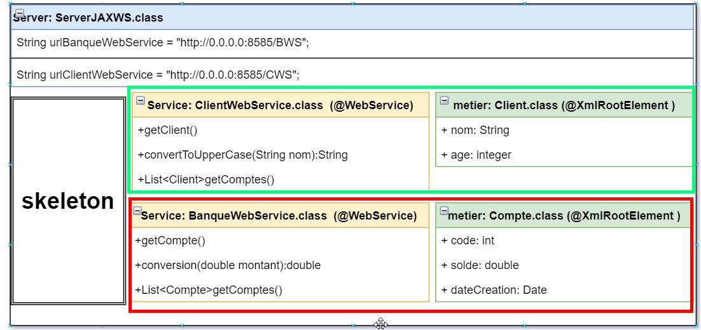
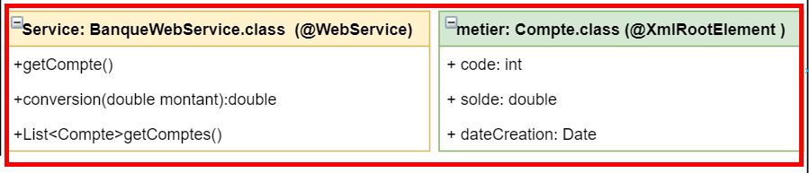
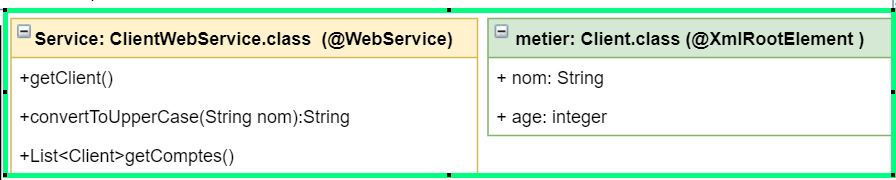
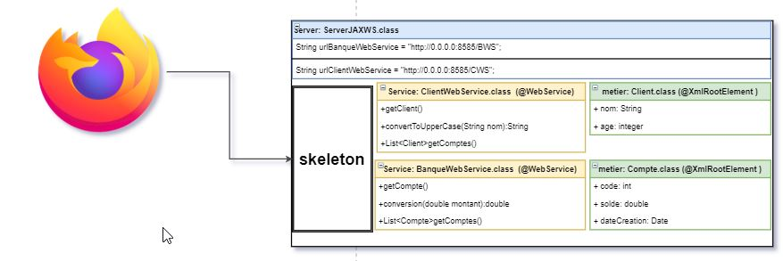
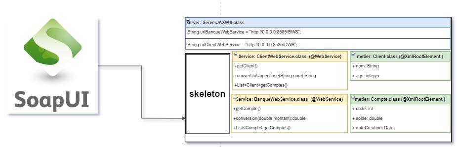
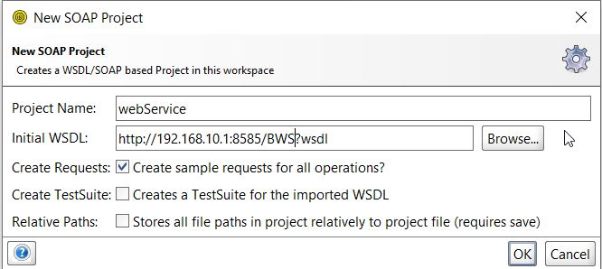
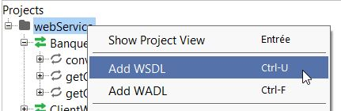
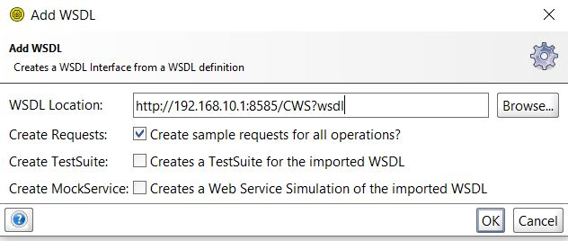
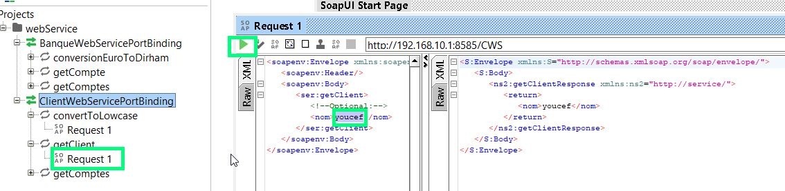

# Mise en œuvre des web services SOAP avec JAX-WS

[video youtube](https://www.youtube.com/watch?v=SG7u-7_0LLU&list=PLxr551TUsmAozms7qX1iT8JzAwllHq0vD&index=2)


* Créer un web service java en utilisant JaxWS qui permet de :
    - Pour le Service Compte (BanqueWebService) :
        - **Convertir** un montant de l’Euro en DH ( dihram )
        - **Consulter** un compte sachant son **code**
        - **Consulter** une **liste de comptes**
    - Pour le Service Client (ClientWebService) :
        - **ConvertirToUpperCase** String en majuscule
        - **Consulter** un client sachant son **nom**
        - **Consulter** une **liste de client**
        



#
* Tester le web service avec
    - Analyseur **SOAP** ( SOAPUI)
    - Créer un client soap **Java**
    - Créer un client soap **.Net**
    - Créer un client soap **PHP**


## prerequis

### Annotation
Tous les objets manipulés par le web Service doivent  disposés de l'annotation **@XmlRootElement** . 


## Création d'un web Service SOAP BanqueWebService




**Classe metier Compte**

```java
package metier;

import java.io.Serializable;
import java.util.Date;

import javax.xml.bind.annotation.XmlAccessType;
import javax.xml.bind.annotation.XmlAccessorType;
import javax.xml.bind.annotation.XmlRootElement;
import javax.xml.bind.annotation.XmlTransient;

// Il faut annoter les classes qui sont invoqués par jax-ws.
@XmlRootElement(name = "compte")
// Cette annotation XmlAccessorType est nécessaire pour  le xmlTransient 
// directement sur les attributs et non sur les methodes
@XmlAccessorType(XmlAccessType.FIELD)
public class Compte implements Serializable {

	private Long code;
	private double solde;

	@XmlTransient // attribut masqué du client SOAP
	private Date dateCreation;

	public Compte(Long code, double solde, Date dateCreation) {
		super();
		this.code = code;
		this.solde = solde;
		this.dateCreation = dateCreation;
	}

	public Compte() {
		super();
		// TODO Auto-generated constructor stub
	}

	public Long getCode() {
		return code;
	}

	public void setCode(Long code) {
		this.code = code;
	}

	public double getSolde() {
		return solde;
	}

	public void setSolde(double solde) {
		this.solde = solde;
	}

	public Date getDateCreation() {
		return dateCreation;
	}

	public void setDateCreation(Date dateCreation) {
		this.dateCreation = dateCreation;
	}
}
```

**Classe service BanqueWebService**


```java
package service;

import java.util.ArrayList;
import java.util.Date;
import java.util.List;

import javax.jws.WebMethod;
import javax.jws.WebParam;
import javax.jws.WebService;

import metier.Compte;

@WebService(name = "BanqueWebService")
public class BanqueWebService {

	@WebMethod(operationName = "conversionEuroToDirham")
	public double conversion(@WebParam(name = "montant") double montant) {
		return montant * 11 * 3;
	}

	@WebMethod
	public Compte getCompte(@WebParam(name = "code") Long code) {
		return new Compte(code, Math.random() * 80000, new Date());
	}

	@WebMethod
	public List<Compte> getComptes() {
		List<Compte> comptes = new ArrayList<Compte>();
		comptes.add(new Compte(1L, Math.random() * 80000, new Date()));
		comptes.add(new Compte(2L, Math.random() * 80000, new Date()));
		comptes.add(new Compte(3L, Math.random() * 80000, new Date()));
		comptes.add(new Compte(4L, Math.random() * 80000, new Date()));
		comptes.add(new Compte(5L, Math.random() * 80000, new Date()));

		return comptes;
	}
}
```


## Création d'un web Service SOAP ClientWebService




**Classe metier Client**

```java
package metier;

import java.io.Serializable;
import java.util.Date;

import javax.xml.bind.annotation.XmlAccessType;
import javax.xml.bind.annotation.XmlAccessorType;
import javax.xml.bind.annotation.XmlRootElement;
import javax.xml.bind.annotation.XmlTransient;

// il faut annoter les classes qui sont invoquer par jax-ws.
@XmlRootElement(name = "client")
@XmlAccessorType(XmlAccessType.FIELD) // necessaire pour le xmlTransient directement sur les attributs et non sur les
										// methodes
public class Client implements Serializable {

	private String nom;

	@XmlTransient // attribut masqué du client SOAP
	private String age;

	public String getNom() {
		return nom;
	}

	public void setNom(String nom) {
		this.nom = nom;
	}

	public String getAge() {
		return age;
	}

	public void setAge(String age) {
		this.age = age;
	}

	public Client(String nom, String age) {
		super();
		this.nom = nom;
		this.age = age;
	}

	public Client() {
		super();
	}

}

```

**Classe Service ClientWebService**

```java
package service;

import java.util.ArrayList;
import java.util.Date;
import java.util.List;

import javax.jws.WebMethod;
import javax.jws.WebParam;
import javax.jws.WebService;

import metier.Client;

@WebService(name = "ClientWebService")
public class ClientWebService {

	@WebMethod(operationName = "convertToLowcase")
	public String convertToUpperCase(@WebParam(name = "nom") String nom) {
		return nom.toUpperCase();
	}

	@WebMethod
	public Client getClient(@WebParam(name = "nom") String nom) {
		return new Client(nom, "random");
	}

	@WebMethod
	public List<Client> getComptes() {
		List<Client> clients = new ArrayList<Client>();
		clients.add(new Client("nom1", "random"));
		clients.add(new Client("nom2", "random"));
		clients.add(new Client("nom3", "random"));

		return clients;
	}
}

```


## Création du server WebService et publications des services SOAP 

Les WebServices SOAP **BanqueWebService** et **ClientWebService** sont publiés et accessible à leurs endpoints respectifs **BWS** et **CWS**


```java
package jaxwsServerSOAP;

import java.util.concurrent.ExecutorService;
import java.util.concurrent.Executors;

import javax.xml.ws.Endpoint;

import service.BanqueWebService;
import service.ClientWebService;

public class ServerJAXWS {

	public static void main(String[] args) {

		// Ecoute les connexions clientes sur toutes les interfaces
		String urlBanqueWebService = "http://0.0.0.0:8585/BWS";
		String urlClientWebService = "http://0.0.0.0:8585/CWS";

		// Permet de lancer un Server JAX-WS avec la Classe BanqueWebService et
		// ClientWebService.
		Endpoint.publish(urlBanqueWebService, new BanqueWebService());
		Endpoint.publish(urlClientWebService, new ClientWebService());

		System.out.println(urlBanqueWebService);
		System.out.println(urlClientWebService);

	}

}

```

```bash
http://0.0.0.0:8585/BWS
http://0.0.0.0:8585/CWS
```


## Connexion manuelle au WSDL via browser





http://192.168.10.1:8585/**BWS?wsdl**


http://192.168.10.1:8585/**CWS?wsdl**
exemple de sortie pour client

```xml
<!-- Published by JAX-WS RI (http://jax-ws.java.net). RI's version is JAX-WS 
	RI 2.2.9-b130926.1035 svn-revision#5f6196f2b90e9460065a4c2f4e30e065b245e51e. -->
<!-- -->
<definitions targetNamespace="http://service/"
	name="ClientWebServiceService">
	<types>
	</types>
	<message name="getComptes">
		<part name="parameters" element="tns:getComptes" />
	</message>
	<message name="getComptesResponse">
		<part name="parameters" element="tns:getComptesResponse" />
	</message>
	<message name="getClient">
		<part name="parameters" element="tns:getClient" />
	</message>
	<message name="getClientResponse">
		<part name="parameters" element="tns:getClientResponse" />
	</message>
	<message name="convertToLowcase">
		<part name="parameters" element="tns:convertToLowcase" />
	</message>
	<message name="convertToLowcaseResponse">
		<part name="parameters" element="tns:convertToLowcaseResponse" />
	</message>
	<portType name="ClientWebService">
		<operation name="getComptes">
			<input
				wsam:Action="http://service/ClientWebService/getComptesRequest"
				message="tns:getComptes" />
			<output
				wsam:Action="http://service/ClientWebService/getComptesResponse"
				message="tns:getComptesResponse" />
		</operation>
		<operation name="getClient">
			<input
				wsam:Action="http://service/ClientWebService/getClientRequest"
				message="tns:getClient" />
			<output
				wsam:Action="http://service/ClientWebService/getClientResponse"
				message="tns:getClientResponse" />
		</operation>
		<operation name="convertToLowcase">
			<input
				wsam:Action="http://service/ClientWebService/convertToLowcaseRequest"
				message="tns:convertToLowcase" />
			<output
				wsam:Action="http://service/ClientWebService/convertToLowcaseResponse"
				message="tns:convertToLowcaseResponse" />
		</operation>
	</portType>
	<binding name="ClientWebServicePortBinding"
		type="tns:ClientWebService">
		<soap:binding
			transport="http://schemas.xmlsoap.org/soap/http" style="document" />
		<operation name="getComptes">
			<soap:operation soapAction="" />
			<input>
				<soap:body use="literal" />
			</input>
			<output>
				<soap:body use="literal" />
			</output>
		</operation>
		<operation name="getClient">
			<soap:operation soapAction="" />
			<input>
				<soap:body use="literal" />
			</input>
			<output>
				<soap:body use="literal" />
			</output>
		</operation>
		<operation name="convertToLowcase">
			<soap:operation soapAction="" />
			<input>
				<soap:body use="literal" />
			</input>
			<output>
				<soap:body use="literal" />
			</output>
		</operation>
	</binding>
	<service name="ClientWebServiceService">
		<port name="ClientWebServicePort"
			binding="tns:ClientWebServicePortBinding">
			<soap:address location="http://192.168.10.1:8585/CWS" />
		</port>
	</service>
</definitions>
```


## Connexion manuelle au WSDL via SOAPUI





#### Recupération du WSDL du webservice banqueWebService
http://192.168.10.1:8585/**BWS?wsdl**




#### Recupération du WSDL du webservice clientWebService
http://192.168.10.1:8585/**CWS?wsdl**








#### Test d'un service.




----------------------------------------------------------------


```java

```


```bash

```


