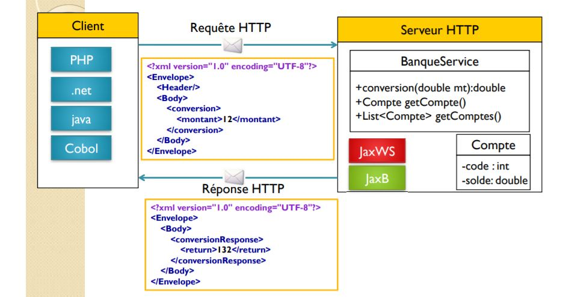
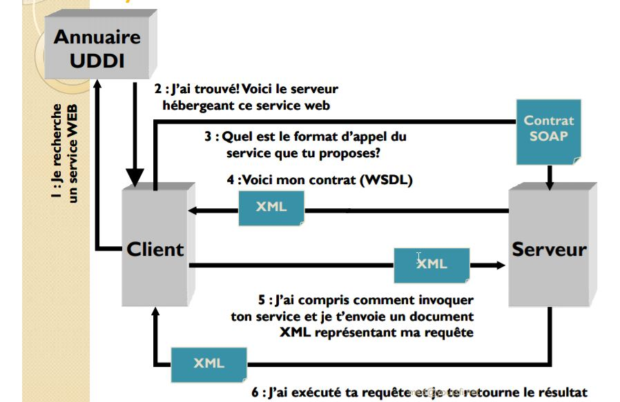
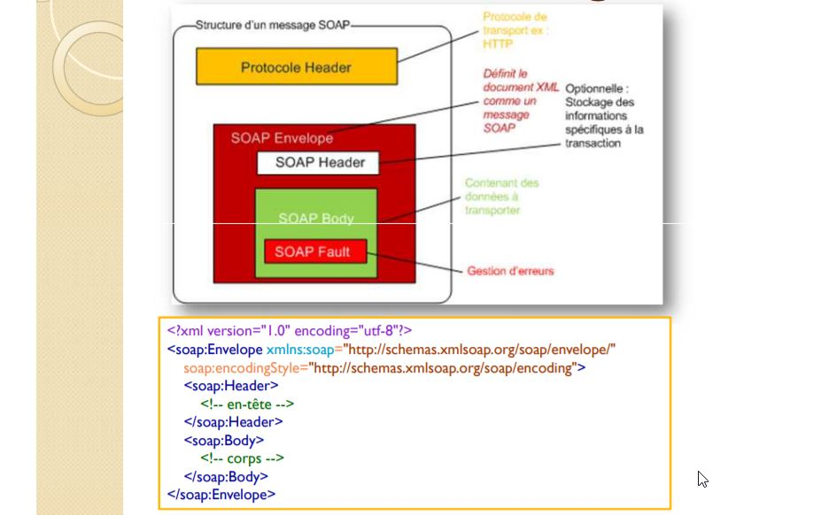

# SOAP

## Conception SOAP

- Concepts des web services
    - Le concept des Web Services s’articule actuellement autour des trois concepts suivants :
        - **SOAP** (Simple Object Access Protocol)
            - est un protocole d'échange inter-applications indépendant de toute plate-forme basé sur le langage XML.
            - un appel de service SOAP est un flux ASCII encadré dans des balises XML et
transporté dans le protocole HTTP.
        - **WSD**L (Web Services Description Language)
            - donne la description au format XML des Web Services en précisant les méthodes
pouvant être invoquées, leurs signatures et le point d’accès (URL, port, etc..).
            - C’est, en quelque sorte, l’équivalent du langage IDL pour la programmation distribuée CORBA.
        - **UDDI** (Universal Description, Discovery and Integration)
            - normalise une solution d’annuaire distribué de Web Services, permettant à la fois la publication et l'exploration (recherche) de Web Services.
            - UDDI se comporte lui-même comme un Web service dont les méthodes sont
appelées via le protocole SOAP.


SOAP est généralement utilser pour les échanges de données inter-systemes et non avec les applicatoins utilisateurs.


- **JAX-WS** est la nouvelle appellation de **JAX-RPC** (Java API for XML Based RPC) qui permet de développer très simplement des services web en Java.

**JAX-WS** fournit un ensemble d'annotations ( **@WebService** / **@WebMethod** / **@WebParam...**  )  pour mapper la correspondance **Java-WSDL**. Il suffit pour cela d'annoter directement les classes Java qui vont représenter le service web. Dans l'exemple ci-dessous, une classe Java utilise des annotations JAX-WS qui vont permettre par la suite de générer le document WSDL. Le document WSDL est auto-généré par le serveur d'application au moment du déploiement :

```java
import javax.jws.*;
import javax.jws.soap.SOAPBinding;
import javax.jws.soap.SOAPBinding.Style;

@WebService
@SOAPBinding(style=Style.RPC)  
public  interface IHello {
	@WebMethod
	String say(@WebParam(name="nom") final String name);
}
```

**Java Architecture for XML Web Services (JAX-WS)** is a Java programming language for creating web services, particularly SOAP services.

**Java Architecture for XML Binding (JAXB)** is a Java-XML binding technology that simplifies the development of web services by enabling transformations between a schema and Java objects, and also between XML instance documents and Java object instances.

Both **JAX-WS** and **JAXB** have been a part of JDK since version 6. **JAX-WS uses JAXB internally as the binding**


###  SOAP cinématique




### Cycle de vie SOAP



### Structure message SOAP



