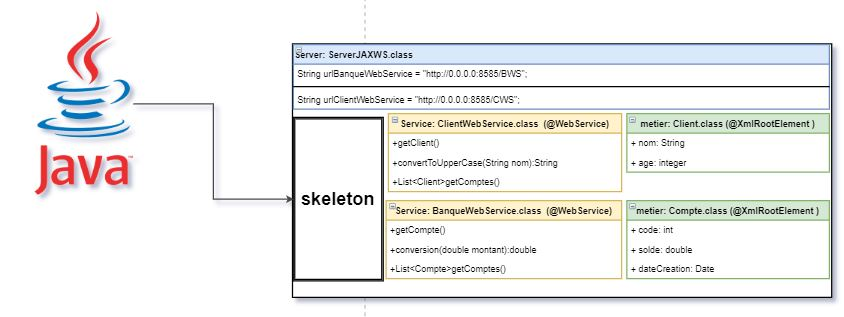
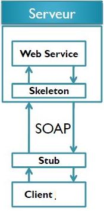
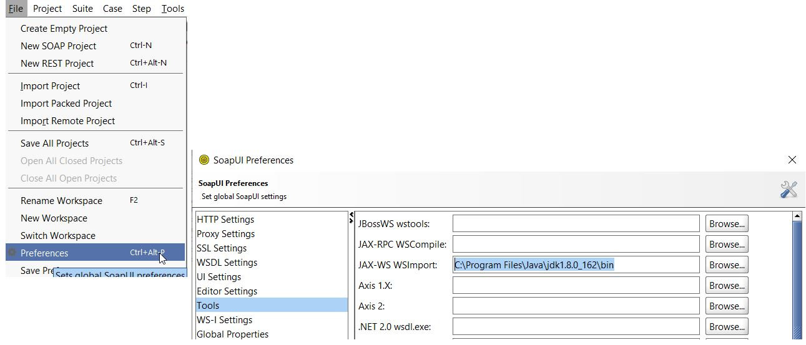
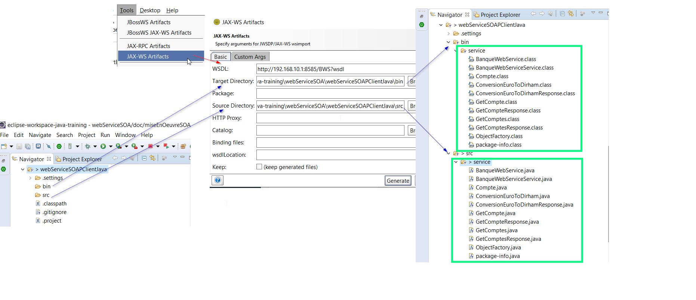
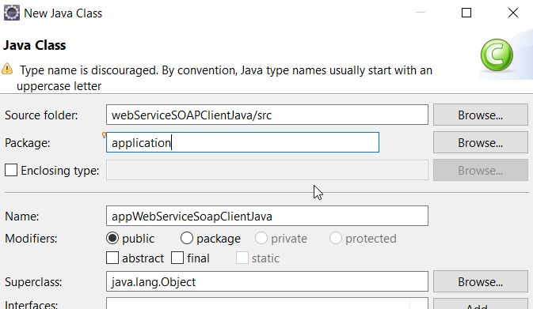

# Client SOAP en Java

[video youtube](https://www.youtube.com/watch?v=pCRzaY4LWJo&list=PLxr551TUsmAozms7qX1iT8JzAwllHq0vD&index=3)







- **Créer un nouveau projet Java**
- **Générer un proxy STUB**
    - SoapUI est l’un des outils qui peuvent être utilisés pour générer les artefacts client en utilisant différents Framework (Axis, CXF, JaxWS, etc…)
    - Le JDK fournit une commande simple **wsimport** qui permet de générer un STUB JaxWS pour l’accès à un webservice. Cette Commande peut s'executer sur le client ou server sans devoir lancer manuellement cette commande à la main. Il faut s'assurer d'avoir le jdk sur le server ou s'execute soapUI.
    - SoapUI a besoin de savoir le chemin de cette commande
    - Depuis soapUi File >Preferences>Tools , vous pouvez configurer le ce chemin comme le montre la figure suivante :


## configuration soapUI
####  configuration du chemin du binaire **wsimport** pour JAX-WS




## Génération des classes (.java) et le bytecode ( .class)
il faut préciser le repertoire **Target** pour le bytecode (.class) et le repertoire **Source** pour les classes java (.java). 

Generation du webServiceBanque (BWS)

http://192.168.10.1:8585/BWS?wsdl



Effectuer la meme chose pour le webServiceClient

```bash
http://192.168.10.1:8585/CWS?wsdl
```
## ou génération manuelle via wsimport

Generation et compilation du webService banque (BWS)


```bat
wsimport.exe -d C:\PERSONNEL\eclipse-workspace-java-training\webServiceSOA\webServiceSOAPClientJava\bin -s C:\PERSONNEL\eclipse-workspace-java-training\webServiceSOA\webServiceSOAPClientJava\src -verbose http://192.168.10.1:8585/BWS?wsdl
```

Effectuer la meme chose pour le webServiceClient (CWS)

```bash
http://192.168.10.1:8585/CWS?wsdl
```


## Application Client Java main

Créér une nouvelle Classe main dans le package application





La classe main.

```bash
package application;

import java.util.List;

import service.BanqueWebService;
import service.BanqueWebServiceService;
import service.Client;
import service.ClientWebService;
import service.ClientWebServiceService;
import service.Compte;

public class appWebServiceSoapClientJava {


	 public static void main(String[] args) {
		
		 // BanqueWebService et le WebService soap exposé.
		 BanqueWebService stubBanque = new BanqueWebServiceService().getBanqueWebServicePort();
		 Compte compte = stubBanque.getCompte(1L) ; 
		 System.out.println(compte.getSolde());
		 
		 Double montant = stubBanque.conversionEuroToDirham(100) ;
		 System.out.println("montant conversion 100euros: "+montant);
		 
		 List<Compte> comptes = stubBanque.getComptes() ; 
		 
		 for (Compte c:comptes)
		 {
			 System.out.println("code: "+ c.getCode() + " solde: "+ c.getSolde());
		 }
		 
		 /*
		  Resultat
		  	55444.26663184944
			montant conversion 100euros: 3300.0
			code: 1 solde: 7285.530767676764
			code: 2 solde: 42676.21418284019
			code: 3 solde: 36756.52112541289
			code: 4 solde: 59337.82985501098
			code: 5 solde: 5952.432874987679	 
		  */
		 
		 

		 // ClientWebService et le WebService soap exposé.
		 ClientWebService stubClient = new ClientWebServiceService().getClientWebServicePort();
		 Client client = stubClient.getClient("youcef") ; 
		 System.out.println(client.getNom());
		 
		 String chaineMajuscule = stubClient.convertToLowcase("AbCdEfGh");
		 System.out.println("la chaine AbCdEfGh en majuscule est: "+chaineMajuscule);
		 
		 
		 /*
		  	Resultat:
		  	youcef
			La chaine AbCdEfGh en majuscule est: ABCDEFGH

		  */		 
	}
}

```