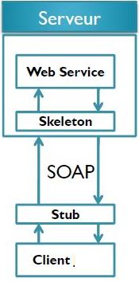

# Client SOAP en Csharp

[video youtube](https://www.youtube.com/watch?v=0WKP0x_qvnU&list=PLxr551TUsmAozms7qX1iT8JzAwllHq0vD&index=4)





- **Créer un nouveau projet console**
- **Générer un proxy STUB**
    - SoapUI est l’un des outils qui peuvent être utilisés pour générer les artefacts client en utilisant différents Framework (Axis, CXF, JaxWS, dotNet etc…)
    - On utilsera plutôt  Visual Studio et ajouté une référence vers les webServices

    
 
## creation du projet console

Création d'un projet console avec Visual Studio


## Génération de l'assembly

Ajouter une référence externe.


verification du stub


## Application Client Csharp main

Programme csharp
 
```csharp
using System;
using System.Collections.Generic;
using System.Linq;
using System.Text;
using System.Threading.Tasks;

namespace webServvicesSoapClientcSharp
{
    class Program
    {
        static void Main(string[] args)
        {

            Service.BanqueWebService stubBanque = new Service.BanqueWebServiceClient();
            double montant = 100; 
            double conversionArgent = stubBanque.conversionEuroToDirham(montant);
            Console.WriteLine("conversion: " + conversionArgent);

            Service.compte compte = stubBanque.getCompte(1.0);
            Console.WriteLine("solde: " + compte.solde); 


            //Service.compte compte = stubBanque.getCompte(1L);
        }
    }
}
```