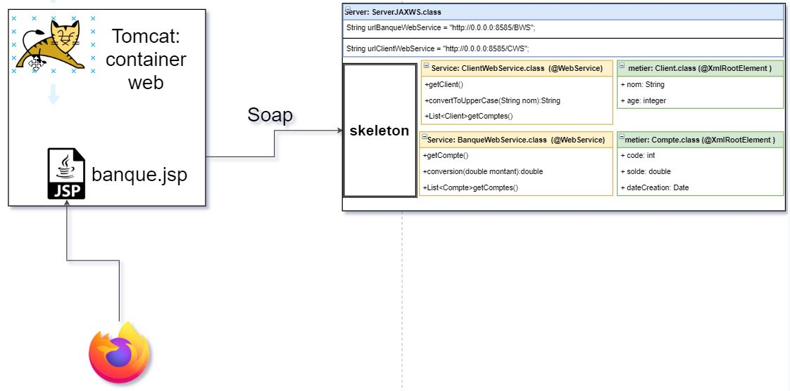
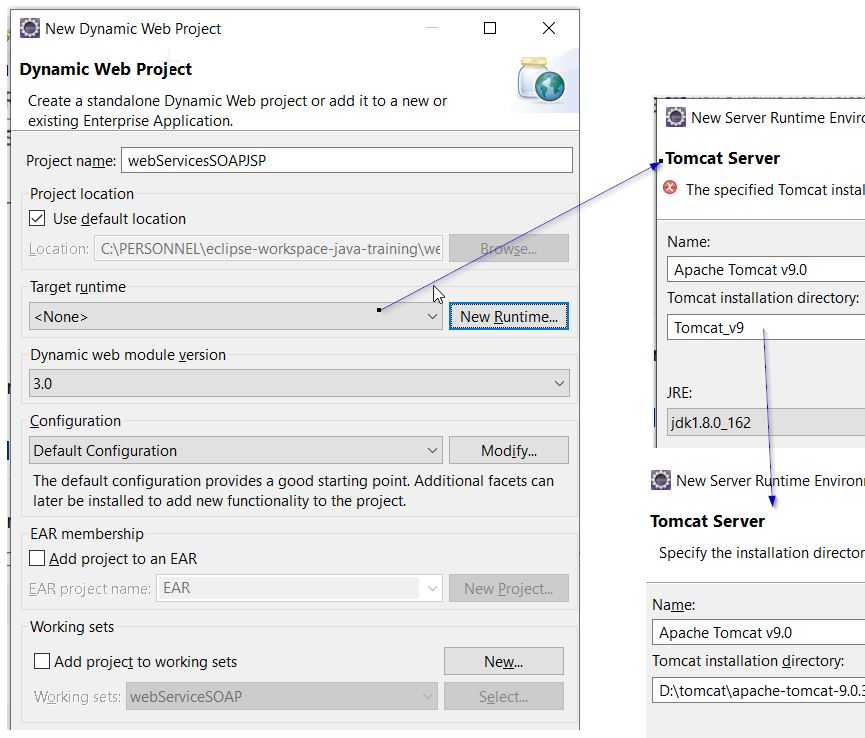
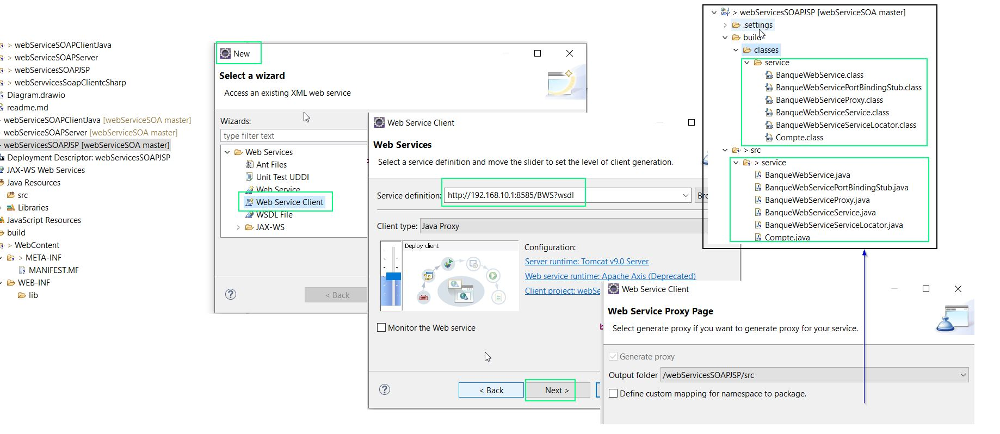
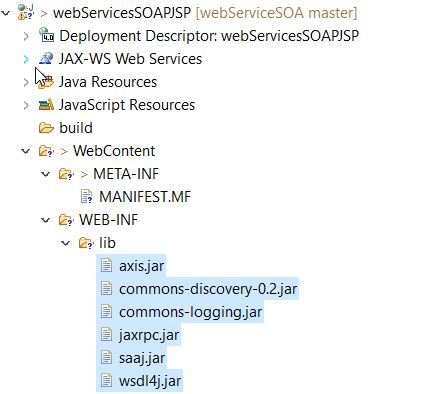
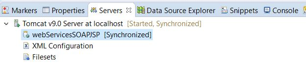
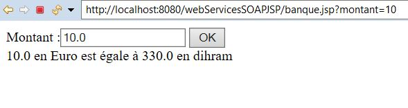

# Client SOAP via JSP


[video youtube](https://www.youtube.com/watch?v=QZ7_MnC84OQ&list=PLxr551TUsmAozms7qX1iT8JzAwllHq0vD&index=5)

[tuto](https://www.eclipse.org/webtools/community/education/web/t320/Generating_a_client_from_WSDL.pdf)





- **Créer un nouveau Web projet Dynamic **
- **Générer un proxy STUB**
    - On peut aussi bien utiliser soapUI pour la génération stub comme pour le projet saop client java. soapui peut utilser les annotations **jax-ws, axis1 et 2, dotnet ....**
    - Ici nous allons le faire l'utilitaire de eclipse.  Eclipes utilise l'annotation **Axis**

    
 
## creation Web projet Dynamic

Création d'un projet Web dynamic ( ici nous utilisons tomcat comme server container pour nos page JSP.




## Génération du stub via Eclipse

Eclipe utilse la notation AXIS pour la génération du Stub.

Dans la vision **Navigator** d'eclipse Le repertoire **build/classes** contient le bytecode les fichiers  **.class** tandis que le repertoire **build/src**  contient les fichiers **.java**.





Eclipse importe automatique lors de la génération du stub les jar necessaire

 
 

## Création d'une page JSP

Creer la page jsp **banque.jsp** sous le repertoire **webServicesSOAPJSP/WebContent**

Ici nous allons tester la methode conversion euro en dihram **conversionEuroToDirham**
 
```jsp
<%@page import="service.BanqueWebServiceProxy"%>
<%@ page language="java" contentType="text/html; charset=ISO-8859-1"
	pageEncoding="ISO-8859-1"%>

<%
	double montant = 0;
	double resultat = 0;

	if (request.getParameter("montant") != null) {
		montant = Double.parseDouble(request.getParameter("montant"));
		BanqueWebServiceProxy service = new BanqueWebServiceProxy();
		resultat = service.conversionEuroToDirham(montant);
	}
%>

<!DOCTYPE html>
<html>
<head>
<meta charset="ISO-8859-1">
<title>Conversion euro en dihram</title>
</head>
<body>
	<form action="banque.jsp">
		Montant :<input type="text" name="montant" value="<%=montant%>">
		<input type="submit" value="OK">
	</form>
	<%=montant%> en Euro est égale à <%=resultat%> en dihram
</body>
</html>

```


## lancement du server Tomcat avec le container 

 


## Teste la page jsp

 

