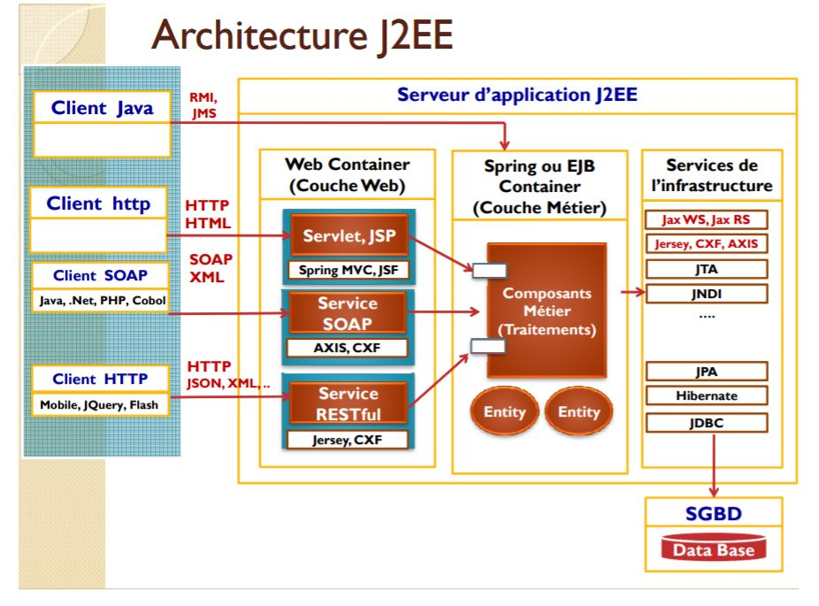
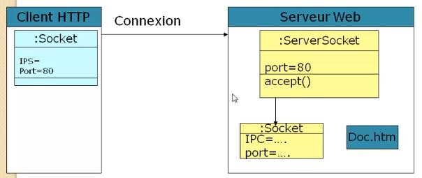
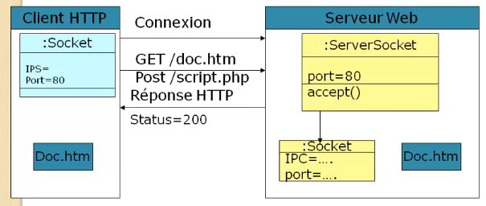
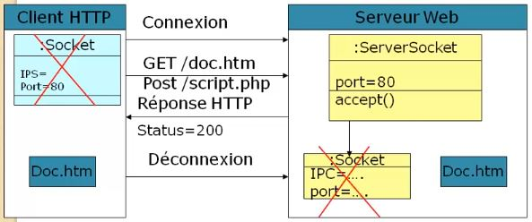

# Web Service SOAP et RESTful  

https://www.youtube.com/watch?v=V1HErlQdrCo


## Exigence d'un projet informatique
* **Exigences fonctionnelles:**
    - Répondre aux besoins fonctionnelles de l'entreprise
* **Exigences techniques:**
    - **Les performances**
        - Temps de réponse
        - HA
        - Problemes de monter en charge
    - **La maintenance:**
        - Application doit évoluer dans le temps
        - Application fermée à la modification et ouverte à l'extension ( IOC)
 * **Sécurité**
 * **Portablité**
 * **Coût logiciel**
 * <span style="color:red">**Distribution**</span>
 * <span style="color:red">**Capacité de communiquer avec d'autres applications distantes ( web Service )**</span>
     - Desktop, mobile, Sms, http, ...
  
  
## Constat 
- **Il faut utiliser les Server d'applications JEE**
    - JBOSS, Web Sphere,WebLogic, GlassFish : Pour EJB ( Container Lourd )
    - Tomcat : pour Spring ( container leger )
    - ...
- **Framework IOC**
    - Spring ( container léger )
    - EJB ( Container lourd )
 - **Framewroks:**
    - Mapping Object Relationel ( ORM), JPA, Hibernate, Toplink
    - Application Web: Struts, JFS, SpringMVC
- **MidlleWares:**
    - RMI, CORBA (Common Object Request Broker Architecture)
    - Applications distribuées
    - <span style="color:red"> JAXWS pour les Web Services SOAP</span>
    - <span style="color:red"> JAXRS pour les Webs Services RESTful</span>
    - JMS: Communication asynchrone entre les application.


Web Server remplace de plus en plus le protocole CORBA.


Architeture Générale J2EE




## SOAP vs RESTful

**Soap** est généralement implémenté pour des communications interfaces applications tant dis que le **RESTful** est implémenté pour des consommations clients mobile , jquery, flash ....

## Web Service SOAP et WSDL


## Rappelle HTTP

Le protocole **http **est **stateless** ( sans état ) Il y a une reconnexion  à toute demande de nouvelles pages. Pour maintenir une connexion permettre le server créé une session que le client devra renvoyer à toute les requetes. Les sessions ont une date d'expérience que le client renouvelle.

### connexion Client vers Server ( creation d'une socket client )


### renvoi doc suit GET/POST


### fermeture de la connexion.



## SOAP

voir see documentation [SOAP](doc/soap.md)


## Mise en oeuvre webServices SOAP Server

voir see documentation [Mise en oeuvre Server](doc/WebServiceSOAPServer.md)


## Mise en oeuvre webServices SOAP Client Java

voir see documentation [Mise en oeuvre Client Java](doc/webServiceSOAPClientJava.md)


## Mise en oeuvre webServices SOAP Client C#

voir see documentation [Mise en oeuvre Client Java](doc/webServicesSOAPClientCsharp.md)

## Mise en oeuvre webServices SOAP Client via JSP page

voir see documentation [Mise en oeuvre Client Java](doc/webServicesSOAPJSP.md)


-------------------------------------------------------------------
-------------------------------------------------------------------

```java

```


```bash

```


```bash
```


```java
```

```java
```


```java
```

```java
```
